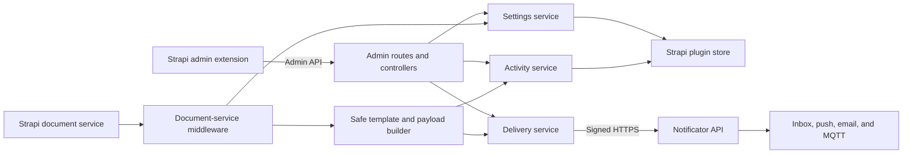

# Architecture

This document describes how Notificator for Strapi observes content changes,
matches rules, creates safe payloads, and delivers local and remote alerts.

## System overview



The extension has two distinct paths:

- The **admin path** reads connection state, manages rules, tests the remote
  connection, and displays the local activity feed.
- The **event path** runs after a successful Strapi document operation, matches
  enabled rules, renders a safe payload, records local activity, and attempts
  remote delivery.

## Package layout

```text
admin/src/
  components/       Admin initializer, toast polling, and plugin icon
  pages/home/       Page state hook and focused presentation panels
  pages/HomePage    Page composition only

server/src/
  config/           Defaults and deployment-time configuration validation
  controllers/      Admin HTTP input and response handling
  routes/           Permission-protected admin endpoints
  services/         Rules, local activity, templates, signing, and delivery
  register.ts       Document-service middleware registration
  types.ts          Shared server domain types

tests/              Behavior tests for core server responsibilities
```

## Content-event pipeline

1. `register.ts` attaches middleware to Strapi's document service.
2. The requested create, update, delete, publish, or unpublish operation runs.
3. Processing continues only after Strapi completes that operation successfully.
4. The extension captures a small actor snapshot while request context is still
   available.
5. Enabled rules are filtered by content-type UID and event name.
6. The delivery service normalizes Strapi's direct-entry and document-envelope
   result shapes.
7. Only public scalar entry attributes become template values or payload data.
8. A local activity record is written when the Strapi activity-log channel is enabled.
9. External channels are sent asynchronously through a signed HTTPS request.
10. Delivery failures are logged and do not roll back the completed content
    operation.

## Admin architecture

`HomePage.tsx` is intentionally a composition layer. `useNotificatorAdmin`
owns remote state, mutations, validation notices, and editor state. Individual
panels render connection readiness, the rule editor, saved rules, and activity.

`Initializer.tsx` owns a page-lifetime poller for native Strapi notifications.
One global runtime instance prevents duplicate intervals during route changes
or React development remounts. Polling requests only activity newer than the
last observed timestamp.

## Storage

The extension uses Strapi's plugin store for two records:

- `settings`: the complete sanitized notification-rule collection.
- `panel-activity`: a newest-first local feed capped at 100 items.

Activity writes are serialized in memory because the plugin store has no atomic
prepend operation. The queue prevents simultaneous events from overwriting one
another. The local feed is operational history, not an immutable audit log.

## Trust boundaries

### Admin browser to Strapi

Admin routes use Strapi permissions. Read access is separate from settings and
activity mutation. The browser receives connection readiness but never API keys
or MQTT credentials.

### Strapi content to templates

Entry data is untrusted. Template resolution:

- reads own properties only;
- never invokes methods or getters;
- excludes private and password attributes;
- excludes relations, components, media, and other complex values;
- limits field count and scalar length;
- resolves missing values to an empty string.

### Strapi to the Notificator API

Every remote request includes a timestamp, nonce, and HMAC-SHA256 signature over
the exact serialized body. The API key and optional custom HiveMQ credentials
remain in server configuration. Deployments may instead set the account-MQTT
toggle, in which case the signed request contains only
`mqttConnection: { mode: "account" }` and the hosted API resolves the encrypted
connection owned by the API-key account. When MQTT is requested but unavailable,
only MQTT is disabled; other selected channels continue.

## Configuration model

Configuration is validated at Strapi startup. Production delivery is fixed to
the official Notificator API endpoint. Development can deliberately override it
with HTTPS or a local endpoint. Timeouts are bounded between 1 and 30 seconds.
MQTT currently targets HiveMQ Cloud's TLS WebSocket service and validates the
hostname and topic prefix before Strapi starts for custom connections. Account
connections are validated and decrypted only by the hosted API.

## Extension points

Keep additions within the existing boundaries:

- Add a content event by updating the shared event types, rule validation,
  middleware matching, admin choices, documentation, and tests together.
- Add a template namespace by extending the canonical template context and
  retaining own-property scalar resolution.
- Add a delivery channel in the rule types, admin editor, payload builder, API
  contract, documentation, and tests.
- Add admin presentation by creating a focused panel rather than expanding
  `HomePage.tsx` with another responsibility.

Changes to signing, secret handling, lifecycle timing, or template access are
security-sensitive and require explicit tests.

## Verification strategy

The automated suite documents four core contracts:

- rule input is normalized, migrated, or rejected predictably;
- template data cannot escape the public scalar boundary;
- concurrent local activity remains ordered and capped;
- remote delivery signs the sent bytes and degrades MQTT independently.

Type checks cover the admin and server packages independently. The Plugin SDK
build and verify commands validate the distributable Strapi package.
